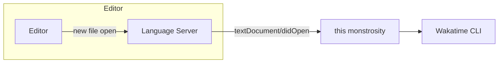

Turns out I started a repo without looking around the Internet first...
There's already something like this: https://github.com/mrnossiom/wakatime-lsp

---

# WakaLSP 

This is a (arguably hacky) way to create [Wakatime Editor Plugins](https://wakatime.com/help/creating-plugin) through an LSP server.

The basic idea is this:

## Why?

Right now the [Zed Editor](https://zed.dev) has [no way for extensions to execute arbitrary code](https://github.com/zed-industries/zed/issues/10795). Instead, extensions can either be LSP clients or themes.

Even when Zed gets the ability to execute arbitrary code, it would be nice to have a way to create Wakatime plugins for any editor or thing that supports LSPs.

## Status

Right now it's just an idea. I might start a PoC by the end of the week.

## How it works

The LSP server receives events and calls the Wakatime CLI

| LSP event | Wakatime docs section |
| --------- | --------------------- |
| [`initialized`](https://microsoft.github.io/language-server-protocol/specifications/lsp/3.17/specification/#initialized) | [Plugin Initialization](https://wakatime.com/help/creating-plugin#plugin-init) |
| [`textDocument/didOpen`](https://microsoft.github.io/language-server-protocol/specifications/lsp/3.17/specification/#textDocument_didOpen) | [File Changed](https://wakatime.com/help/creating-plugin#handling-editor-events:file-changed) |
| [`textDocument/didChange`](https://microsoft.github.io/language-server-protocol/specifications/lsp/3.17/specification/#textDocument_didChange) | [File Modified](https://wakatime.com/help/creating-plugin#handling-editor-events:file-modified) |
| [`textDocument/didSave`](https://microsoft.github.io/language-server-protocol/specifications/lsp/3.17/specification/#textDocument_didSave) | [File Saved](https://wakatime.com/help/creating-plugin#handling-editor-events:file-saved) |
